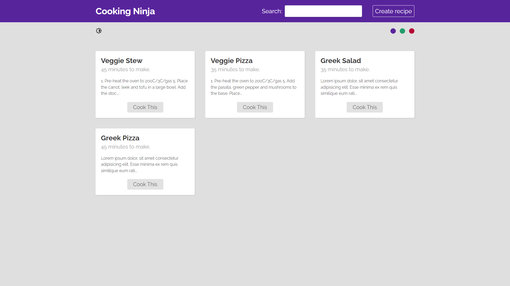

## 📖 Projeto

Um projeto de receitas feito em React.js, utilizando React Router para criação das rotas na aplicação, JSON Server simulando o nosso back-end e tive o primeiro contato com o Hook useReducer. A aplicação é resultado de um curso em inglês (sim, tô treinando) que comprei recentemente na udemy. Fora o inglês, o curso consistia na utilização do ReactRouter na versão antiga (v5), o que acabou sendo algo positivo para os estudos visto que tive a oportunidade de introduzir a nova versão (v6) lançada recentemente. 

## 🧪 Tecnologias

Esse projeto foi desenvolvido com as seguintes tecnologias e bibliotecas:

- [React](https://reactjs.org)
- [Styled-components](https://v5.reactrouter.com/web/guides/quick-start)
- [JSON Server](https://github.com/typicode/json-server)

## 🚀 Como executar

Clone o projeto e acesse a pasta do mesmo.

```bash
$ git clone https://github.com/d0ugui/recipe-directory.git
$ cd recipe-directory
```

Para iniciá-lo, siga os passos abaixo:

```bash
# O JSON precisa ser instalado globalmente
$ npm install -g json-server

# Rodando o back-end
$ json-server --watch ./data/db.json

# Instalar as dependências
$ yarn or npm

# Iniciar o projeto
$ yarn start or npm start
```

O app estará disponível no seu browser pelo endereço http://localhost:3001/

## 📝 License

Esse projeto está sob a licença MIT.